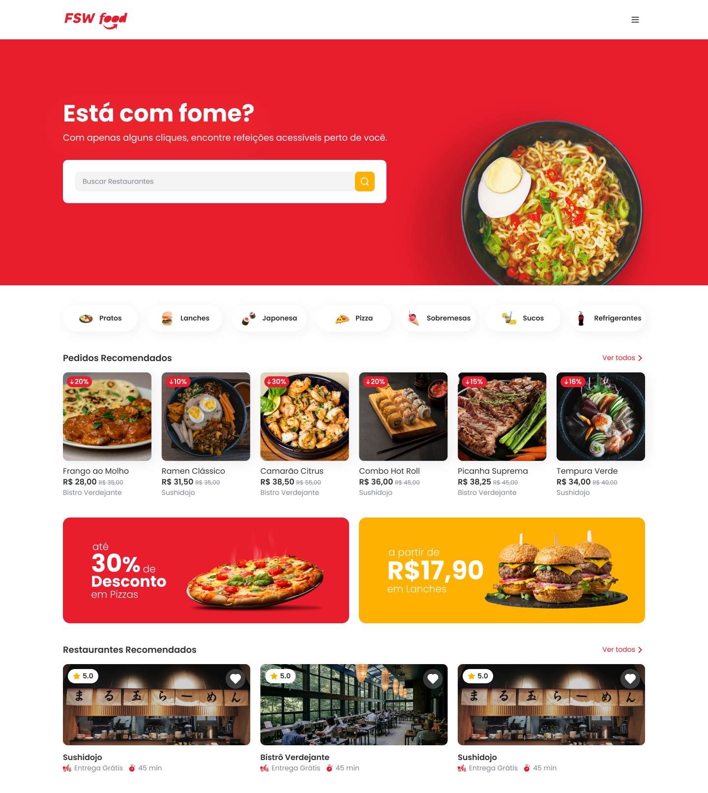

# 🍔 FSW Food

Uma aplicação moderna de delivery de comida desenvolvida com **Next.js**, **TailwindCSS** e foco em experiência do usuário, performance e design responsivo.

## 📸 Preview do Projeto

> Interface moderna para busca de restaurantes, categorias de alimentos, promoções e pedidos recomendados.

---

## 🚀 Tecnologias Utilizadas

Este projeto foi desenvolvido utilizando as seguintes tecnologias:

- ⚡ **Next.js**
- 🎨 **TailwindCSS**
- 🟨 **TypeScript**
- ⚛️ **React.js**
- 📱 **Responsive Design**
- 🔍 **Search UI**
- 🍕 Sistema de categorias de alimentos

---

## ✨ Funcionalidades

✅ Busca de restaurantes  
✅ Categorias de comidas  
✅ Sessão de pedidos recomendados  
✅ Cards de produtos com desconto  
✅ Restaurantes recomendados  
✅ Promoções especiais  
✅ Interface responsiva  
✅ Design moderno e intuitivo

---

## 🖼️ Layout do Projeto

O sistema possui:

### 🏠 Home Page

- Banner principal
- Campo de busca
- Categorias de comida
- Produtos recomendados
- Promoções
- Restaurantes próximos

### 🍕 Categorias

- Pratos
- Lanches
- Japonesa
- Pizza
- Sobremesas
- Sucos
- Refrigerantes

### 🛍️ Produtos

- Nome do prato
- Preço
- Restaurante
- Imagem
- Descontos promocionais

---

## 🧑‍💻 Autor

Desenvolvido por **Julio Paschoal** 🚀

---

## 📄 Licença

Este projeto está sob a licença MIT.
